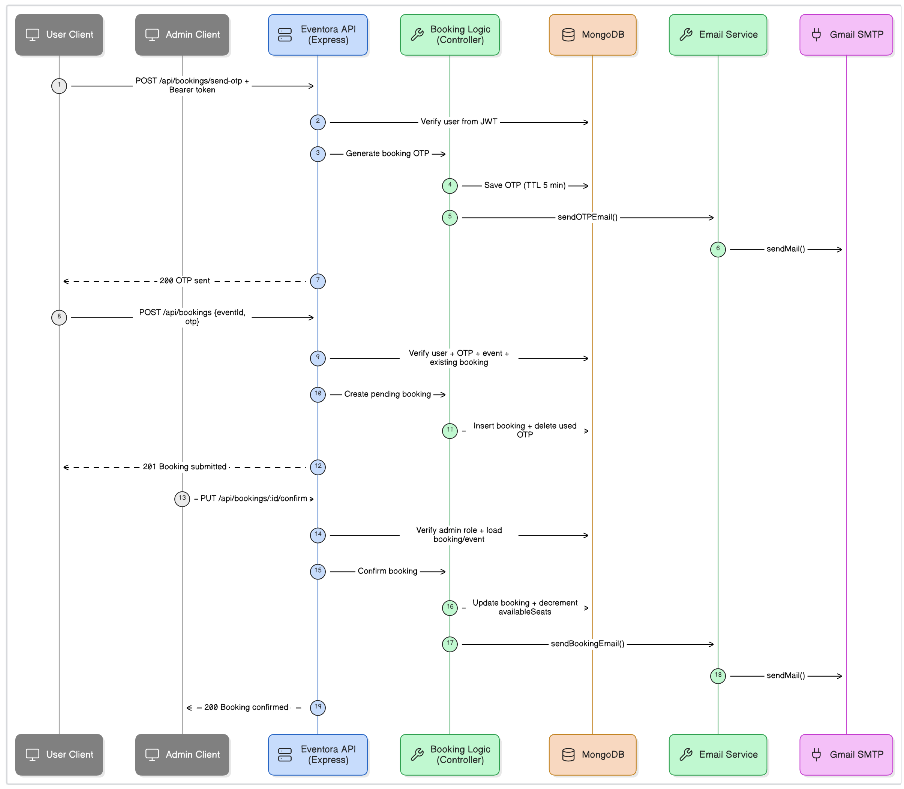
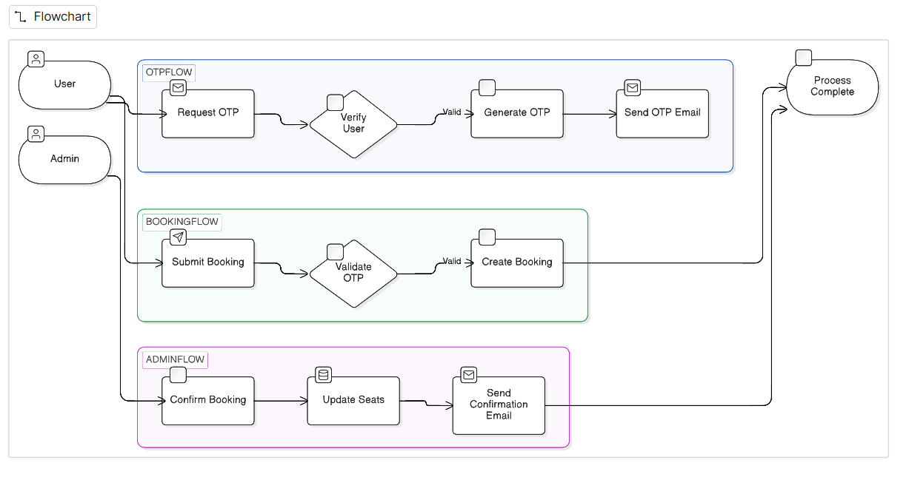

<div align="center">

# 🎟️ Eventora

### A full-stack event booking platform with OTP-secured bookings and an admin approval workflow

[**🌐 Live Demo**](https://eventora-mern-wheat-two.vercel.app/) · [**🐛 Report Bug**](https://github.com/rohit-codec/Eventora-MERN/issues) · [**✨ Request Feature**](https://github.com/rohit-codec/Eventora-MERN/issues)


</div>

---

## 📑 Table of Contents

- [About](#-about)
- [Features](#-features)
- [Tech Stack](#-tech-stack)
- [How Booking Works](#-how-booking-works)
- [Project Structure](#-project-structure)
- [Getting Started](#-getting-started)
- [Seeding Demo Data](#-seeding-demo-data)
- [API Reference](#-api-reference)
- [Data Models](#-data-models)
- [Scripts](#-scripts)
- [Deployment Notes](#-deployment-notes)
- [Roadmap](#-roadmap)
- [Contributing](#-contributing)
- [Author](#-author)

---

## 📖 About

**Eventora** lets users browse, book, and manage tickets for free and paid events, while organizers manage everything from a dedicated admin dashboard.

It deliberately avoids third-party payment gateways: every booking request, free or paid, lands in a **Pending** queue where an admin verifies it, marks payment as *Paid* / *Not Paid*, and confirms it. Bookings are protected by **email OTP (2FA)**, and seat counts are validated so events can't be overbooked.

---

## ✨ Features

### 👤 For Users
- Register and log in with **JWT** authentication and **bcrypt**-hashed passwords
- **Email OTP verification** to activate a new account
- Browse events with category, date, location, price, and seat availability
- **OTP-verified booking requests** for each ticket
- Personal dashboard to track booking status (pending / confirmed / cancelled) and cancel bookings
- Email notification when a booking is confirmed

### 🛠️ For Admins
- Create, edit, and delete free or paid events (title, description, image URL, date, category, price, capacity)
- Review all incoming booking requests, then **confirm** or **reject** them
- Mark bookings as **Paid** or **Not Paid**
- Analytics at a glance: pending requests, total revenue, and confirmed paid clients
- Admin access is restricted to database-flagged users (`role: admin`)

### 🔒 Security & Reliability
- Role-based route protection (`protect` and `admin` middleware)
- OTPs expire automatically after **5 minutes** (MongoDB TTL index) and are single-use
- Duplicate-booking prevention per user per event
- Seats are deducted only when an admin confirms, and restored if a confirmed booking is cancelled

---

## 🧰 Tech Stack

| Layer | Technologies |
|-------|--------------|
| **Frontend** | React 18, React Router v6, Axios, Tailwind CSS, React Icons, Vite |
| **Backend** | Node.js, Express |
| **Database** | MongoDB with Mongoose |
| **Auth** | JSON Web Tokens, bcryptjs |
| **Email** | Nodemailer (Gmail SMTP) |
| **Tooling** | Nodemon, Concurrently, Postman collection |
| **Hosting** | Vercel (frontend) |

---

## 🔄 How Booking Works

```
 User                      API                        Admin
  │  POST /bookings/send-otp │                           │
  │ ───────────────────────► │  generate OTP (5 min TTL) │
  │ ◄─────── email OTP ───── │                           │
  │  POST /bookings {eventId, otp}                       │
  │ ───────────────────────► │  verify OTP, seats, dupes │
  │ ◄── 201 Pending booking ─│                           │
  │                          │   PUT /bookings/:id/confirm
  │                          │ ◄──────────────────────── │
  │                          │  status = confirmed,      │
  │                          │  seats − 1, email user    │
  │ ◄── confirmation email ──│                           │
```

A full sequence diagram is included in the repo as [`dfd.png`](./dfd.png), and a flowchart as [`fc.png`](./fc.png).

<details>
<summary><b>📊 View diagrams</b></summary>
<br>





</details>

---

## 📁 Project Structure

```
Eventora-MERN/
├── client/                      # React + Vite frontend
│   └── src/
│       ├── components/          # Navbar
│       ├── context/             # AuthContext (global auth state)
│       ├── pages/               # Home, EventDetail, Login, Register,
│       │                        # UserDashboard, AdminDashboard,
│       │                        # PaymentSuccess, PaymentFailed
│       └── utils/axios.js       # Axios instance with JWT interceptor
├── server/                      # Express backend
│   ├── controllers/             # auth, event, booking logic
│   ├── middleware/auth.js       # protect + admin guards
│   ├── models/                  # User, Event, Booking, OTP
│   ├── routes/                  # auth, events, bookings
│   ├── utils/email.js           # Nodemailer helpers
│   ├── seed.js                  # Demo data seeder
│   └── server.js                # App entry point
├── postman/                     # Postman collection (YAML)
├── Eventora_Postman_Collection.json
├── SETUP_GUIDE.md               # Detailed MongoDB Atlas + Gmail setup
└── package.json                 # Root scripts to run client + server together
```

---

## 🚀 Getting Started

### Prerequisites

- [Node.js](https://nodejs.org/) v18 or higher
- A MongoDB database, either local or a free [MongoDB Atlas](https://www.mongodb.com/cloud/atlas/register) cluster
- A Gmail account with an [App Password](https://myaccount.google.com/apppasswords) (2-Step Verification must be on)

> 📘 New to Atlas or Gmail App Passwords? Follow the step-by-step [SETUP_GUIDE.md](./SETUP_GUIDE.md).

### 1. Clone the repository

```bash
git clone https://github.com/rohit-codec/Eventora-MERN.git
cd Eventora-MERN
```

### 2. Configure environment variables

Create `server/.env`:

```env
MONGO_URI=mongodb+srv://<user>:<password>@cluster0.xxxxx.mongodb.net/eventora?retryWrites=true&w=majority
JWT_SECRET=replace_with_a_long_random_string
EMAIL_USER=your_gmail_address@gmail.com
EMAIL_PASS=your_16_character_gmail_app_password
PORT=5000
```

| Variable | Description |
|----------|-------------|
| `MONGO_URI` | MongoDB connection string (falls back to `mongodb://localhost:27017/eventora`) |
| `JWT_SECRET` | Secret used to sign JWTs (tokens last 30 days) |
| `EMAIL_USER` | Gmail address that sends OTP and confirmation emails |
| `EMAIL_PASS` | Gmail **App Password** (not your normal password) |
| `PORT` | Backend port (default `5000`) |

> ⚠️ Never commit your `.env` file. It is already listed in `.gitignore`.

### 3. Install dependencies

From the project root:

```bash
npm install
npm run install:all
```

### 4. Run the app

```bash
npm run dev
```

This starts both servers together:

| Service | URL |
|---------|-----|
| Frontend (Vite) | http://localhost:5173 |
| Backend (Express) | http://localhost:5000 |

<details>
<summary><b>Prefer two separate terminals?</b></summary>

```bash
# Terminal 1: backend
cd server
npm install --legacy-peer-deps
npm run dev

# Terminal 2: frontend
cd client
npm install
npm run dev
```
</details>

---

## 🌱 Seeding Demo Data

Populate the database with sample users and events:

```bash
cd server
npm run seed
```

Seeded accounts (all use password `password123`):

| Role | Email |
|------|-------|
| 👑 Admin | `admin@eventora.com` |
| 👤 User | `user@eventora.com` |

> These are demo credentials for local development only. Change or remove them in production.

To promote an existing user to admin manually, set `role: "admin"` on their document in MongoDB.

---

## 🔌 API Reference

Base URL: `http://localhost:5000/api`

🔓 = public · 🔑 = logged-in user · 👑 = admin only

### Auth

| Method | Endpoint | Access | Description |
|--------|----------|--------|-------------|
| `POST` | `/auth/register` | 🔓 | Register a user and send a verification OTP |
| `POST` | `/auth/verify-otp` | 🔓 | Verify account with the emailed OTP |
| `POST` | `/auth/login` | 🔓 | Log in and receive a JWT |

### Events

| Method | Endpoint | Access | Description |
|--------|----------|--------|-------------|
| `GET` | `/events` | 🔓 | List all events |
| `GET` | `/events/:id` | 🔓 | Get a single event |
| `POST` | `/events` | 👑 | Create an event |
| `PUT` | `/events/:id` | 👑 | Update an event |
| `DELETE` | `/events/:id` | 👑 | Delete an event |

### Bookings

| Method | Endpoint | Access | Description |
|--------|----------|--------|-------------|
| `POST` | `/bookings/send-otp` | 🔑 | Email a booking OTP to the logged-in user |
| `POST` | `/bookings` | 🔑 | Submit a booking request (`eventId`, `otp`) |
| `GET` | `/bookings/my` | 🔑 | Your bookings (admins receive all bookings) |
| `PUT` | `/bookings/:id/confirm` | 👑 | Confirm a booking and set `paymentStatus` |
| `DELETE` | `/bookings/:id` | 🔑 | Cancel a booking (owner or admin) |

Protected routes expect an `Authorization: Bearer <token>` header.

🧪 A ready-to-use **Postman collection** is included: import [`Eventora_Postman_Collection.json`](./Eventora_Postman_Collection.json).

---

## 🗄️ Data Models

| Model | Key Fields |
|-------|-----------|
| **User** | `name`, `email` (unique), `password` (hashed), `role` (`user` \| `admin`), `isVerified` |
| **Event** | `title`, `description`, `date`, `location`, `category`, `totalSeats`, `availableSeats`, `image`, `ticketPrice`, `createdBy` |
| **Booking** | `userId`, `eventId`, `status` (`pending` \| `confirmed` \| `cancelled`), `paymentStatus` (`paid` \| `not_paid`), `amount`, `bookedAt` |
| **OTP** | `email`, `otp`, `action` (`account_verification` \| `event_booking`), auto-expires after 5 min |

---

## 📜 Scripts

**Root**

| Command | Description |
|---------|-------------|
| `npm run dev` | Run backend and frontend together |
| `npm run install:all` | Install server and client dependencies |
| `npm run build` | Build the frontend for production |
| `npm run start` | Run backend (`start`) and frontend (`preview`) |

**Server** (`/server`): `npm run dev` (nodemon), `npm start`, `npm run seed`

**Client** (`/client`): `npm run dev`, `npm run build`, `npm run preview`, `npm run lint`

---

## ☁️ Deployment Notes

- **Frontend:** deployed on Vercel at https://eventora-mern-wheat-two.vercel.app/
- **Backend:** deploy the `server/` folder to any Node host (e.g. Render, Railway) and set the same environment variables there.
- **Database:** MongoDB Atlas. Allow your host's IP under *Network Access*.
- ⚙️ The API base URL is currently set in [`client/src/utils/axios.js`](./client/src/utils/axios.js) as `http://localhost:5000/api`. For production, point it to your deployed backend, ideally through an environment variable:

  ```js
  baseURL: import.meta.env.VITE_API_URL || 'http://localhost:5000/api',
  ```

---

## 🛣️ Roadmap

- [ ] Rate limiting on OTP endpoints
- [ ] Event search and filters (category, date, price)
- [ ] Booking quantity (multiple tickets per request)
- [ ] Downloadable e-tickets with QR codes
- [ ] Optional online payment gateway integration
- [ ] Image uploads (currently external image URLs)

---

## 🤝 Contributing

Contributions are welcome!

1. Fork the project
2. Create a feature branch: `git checkout -b feature/amazing-feature`
3. Commit your changes: `git commit -m "Add amazing feature"`
4. Push the branch: `git push origin feature/amazing-feature`
5. Open a Pull Request

---

## 👤 Author

**Rohit** · GitHub: [@rohit-codec](https://github.com/rohit-codec)

If you found this project useful, please consider giving it a ⭐!
